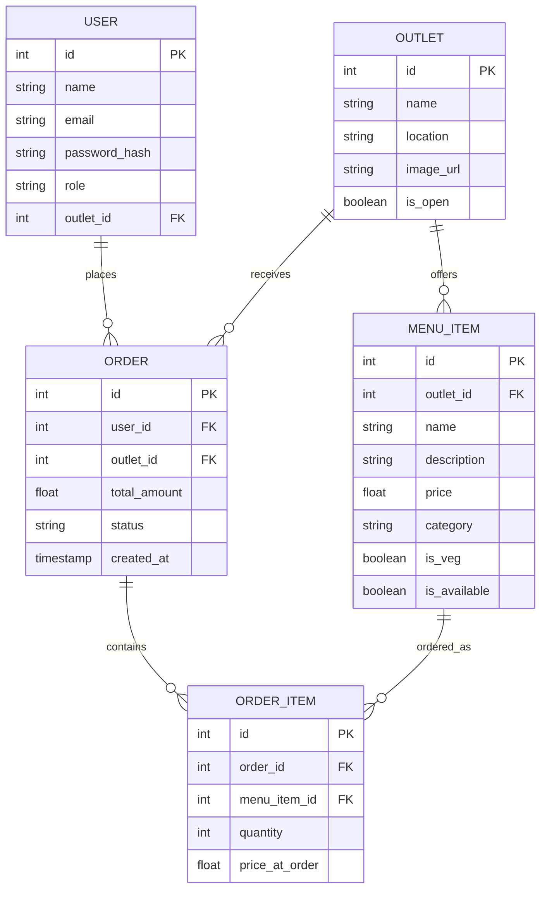

# 🍕 UniBites - Bennett University Food Discovery & Ordering

**UniBites** is a full-stack, multi-role campus dining and food delivery web application designed specifically for Bennett University (covering cafeteria tuck shops, boys/girls hostel courtyards, and student mess helpers). 

The platform features a clean, minimalist Apple-style light visual theme and implements strict role-based data isolation across students, tuck shop owners, and university food department administrators.

---

## 🛠️ Tech Stack

* **Frontend:** React + Vite, Vanilla CSS (Premium Glassmorphism & Custom Micro-Animations).
* **Backend:** Python + FastAPI (Asynchronous REST API, typed JSON schemas).
* **Database:** SQLite (Relational SQL Database managed via SQLAlchemy ORM).
* **Data Flow / Validation:** Pydantic (data parsing/validation), React Context (Cart & Authentication State).

---

## 💡 Key Features

### 1. 🧑‍🎓 Student Portal
* **Live Browse & Search:** Search university outlets, locations (Block H, hostel courtyards), or menu items in real-time.
* **Smart Shopping Cart:** Automatically prevents adding items from different outlets simultaneously.
* **Live Stepper Tracker:** A dynamic visual progress stepper tracking order status (`Pending` ➔ `Preparing` ➔ `Ready` ➔ `Completed`).
* **Mess Menu Helper:** An automated assistant checking the device time to highlight the current active mess meal (Breakfast, Lunch, etc.).

### 2. 👨‍🍳 Merchant Dashboard (Outlet Owners)
* **Order Queue:** Real-time stream of incoming orders to Accept, Prepare, or Complete.
* **Stock Controller:** Toggle item stock status (`In Stock` / `Out of Stock`) and edit names, prices, or categories.
* **Revenue Dashboard:** View total outlet-specific orders, active queues, and cumulative sales revenue.
* **Strict Tenant Isolation:** Shop owners can access and modify only their designated outlet records.

### 3. 👑 Admin Dashboard (Food Department Head)
* **Dining Outlets Registry:** List, add, edit details, or safely delete tuck shops.
* **Merchant Mapping:** Create merchant accounts and map/unmap them to specific cafeterias using interactive controls.
* **Analytics Board:** Monitor global campus-wide sales and order volume in real-time.

---

## 📐 Relational Database Schema



---

## 🚀 Setup & Installation

Follow these steps to run the full-stack project locally:

### 1. Backend Setup (FastAPI)
1. Navigate to the backend directory:
   ```bash
   cd backend
   ```
2. Create and activate a Python virtual environment:
   ```bash
   python3 -m venv venv
   source venv/bin/activate
   ```
3. Install dependencies:
   ```bash
   pip install -r requirements.txt
   ```
4. Seed the database with campus data & demo accounts:
   ```bash
   python seed.py
   ```
5. Start the FastAPI development server:
   ```bash
   uvicorn app.main:app --host 127.0.0.1 --port 8000
   ```

### 2. Frontend Setup (React + Vite)
1. Open a new terminal and navigate to the frontend directory:
   ```bash
   cd frontend
   ```
2. Install npm packages:
   ```bash
   npm install
   ```
3. Start the Vite React development server:
   ```bash
   npm run dev
   ```
4. Open your browser and navigate to `http://localhost:5173/`.

---

## 💡 Quick Demo Credentials (All passwords: `owner123` or `student123`)

* **Student Account:** `student@bennett.edu.in` | `student123`
* **Dev's Cafe Owner:** `owner@bennett.edu.in` | `owner123`
* **Kathi Roll Owner:** `kathi_owner@bennett.edu.in` | `owner123`
* **Maggi Hotspot Owner:** `maggi_owner@bennett.edu.in` | `owner123`
* **Food Department Head (Admin):** `admin@bennett.edu.in` | `admin123`
